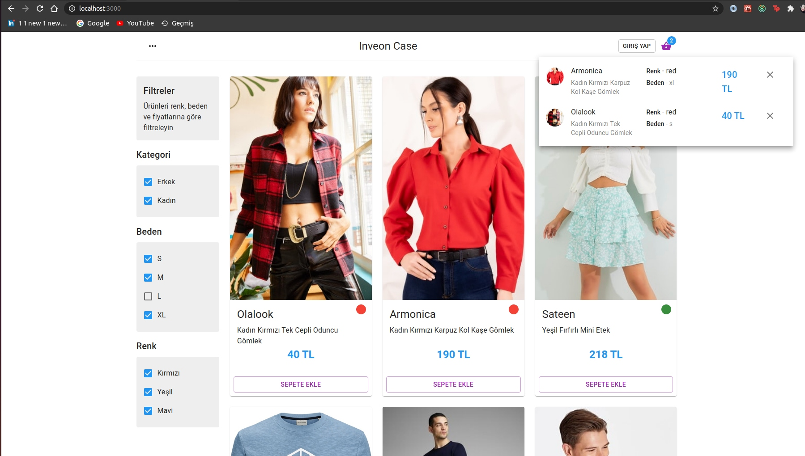

This is a [Next.js](https://nextjs.org/) project bootstrapped with [`create-next-app`](https://github.com/vercel/next.js/tree/canary/packages/create-next-app).

## Getting Started

```bash
git clone https://github.com/didemkaraaslan/inveon_case.git
cd inveon_case/
npm i
npm run dev
# or
yarn dev
```

Open [http://localhost:3000](http://localhost:3000) with your browser to see the result.

# ScreenShot

## Home Screen



# A Quote from Dan Abromov

> "Things that are traditionally sync don’t have to “feel” sync. Things that are traditionally async don’t have to “feel” async. Be intentional and bridge the gap when you need."

### Tech

This app uses a number of libraries.

- [ReactJS] - Frontend Library for awesome apps!
- [Material UI] - Awesome Looking React Components
- [TypeScript ] - Superset of JavaScript with type checking features
- [NextJS] - Hybrid & Static & Server Side Rendering and more..
